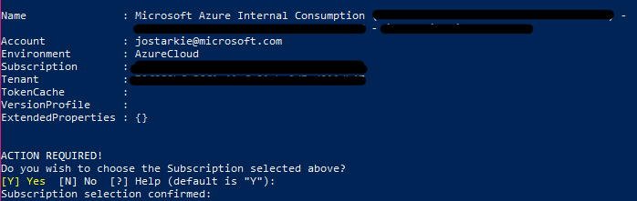
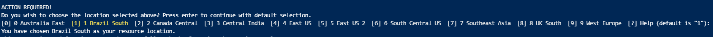
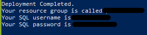
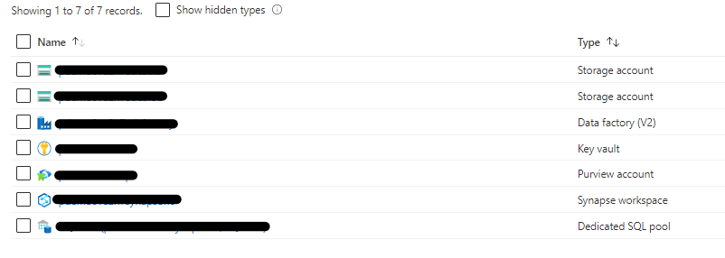

# Azure Purview PoC Accelerator Usage Guide

### :warning: Please note this accelerator should not be used for production, it has been developed purely for proof of concept and exploratory use. ⚠️

**:information_source: Feel free to check out the Bicep driven accelerator currently being developed at [PvDemo GitHub](https://aka.ms/pvdemo)**

## :memo: Table of Contents

- [Prerequisites](#hammer-prerequisites)
- [Introduction](#mega-introduction)
- [Accelerator Outline](#muscle-accelerator-outline)
- [Local Machine Script Execution](#computer-local-machine-script-execution)
- [Cloud Shell Script Execution](#cloud-cloud-shell-script-execution)
- [Limitations](#construction-limitations)
- [Summary](#rocket-summary)
- [What's Next](#thought_balloon-whats-next)
- [Clean Up Resources](#shower-clean-up-resources)
- [Troubleshooting](#triangular_flag_on_post-troubleshooting)


## :hammer: Prerequisites

* An [Azure account](https://azure.microsoft.com/en-us/free/) with an active subscription.
* Your must have permissions to create resources and resource groups in your Azure subscription.
* Your subscription must have the following [resource providers](https://docs.microsoft.com/en-us/azure/purview/create-catalog-portal#configure-your-subscription) registered: **Microsoft.Purview**, **Microsoft.Storage**,  **Microsoft.Sql** and **Microsoft.EventHub**.
* No **Azure Policies** preventing creation of **Storage accounts** or **Event Hub** namespaces. Purview will deploy a managed Storage account and Event Hub when it is created. If a blocking policy exists and needs to remain in place, please follow the [Purview exception tag guide](https://docs.microsoft.com/en-us/azure/purview/create-purview-portal-faq#create-a-policy-exception-for-purview) to create an exception for Purview accounts.
* If you wish to execute the scripts on your local machine, you'll need Windows PowerShell installed.
    * You'll need to open this as an administrator for this to work.
* To prevent the `PSSecurityException` error, run following script to grant permissions:

    * `Set-ExecutionPolicy -ExecutionPolicy UnRestricted -Scope CurrentUser`

## :mega: Introduction 

Initial exploration of Purview can be complicated to set up given all the permissions needed for Purview to access different sources. Purview accelerator is ideal for those initial exploration scenarios as well as scenarios where you need to quickly spin up a Purview demo environment. 

Underlying sources such as Blog Storage, ADLS Gen2 and Synapse are spun up as part of the accelerator, data is generated and moved across the data platform using ADF and permissions are assigned automatically for Purview to access them. 

As a result, you will be able to focus on exploring or demonstrating the Purview UI without having to worry about the logistics of setting up the environment and associating infrastructure. 

Purview Accelerator is for:
- Users who are just getting started with Purview.
- Persons who are looking to demonstrate Purview to an audience.

## :muscle: Accelerator Outline

- Deploy Azure Services:
    - ADLS Gen 2 & Blob Storage
        - Upload sample customer and credit card data files to blob
    - Synapse Analytics Workspace & Dedicated SQL Pool
        - Give user owner access to Synapse Studio
    - Key Vault 
        - Store SQL user password 
    - Azure Purview 
        - Connected Data Factory to capture lineage from pipeline
    - Azure Data Factory
        - Create datasets and linked services for: ADLS, Blob, Synapse & Key Vault
        - Create and trigger pipeline to copy data from Blob, to ADLS and data flow to SQL Pool
- Assigned relevant roles to make the above possible:

| Services  | Role Assigned| Scope |
| --- | --- | --- |
| Purview | `Purview Data Curator` | Data Factory |
| | `Storage Blob Data Reader` | Blob Storage|
| | `Storage Blob Data Reader` | ADLS Gen 2 |
| | `Reader` | Synapse Analytics |
| | `get, set, delete, list` | Key vault |
| Synapse Analytics | `Purview Data Curator` | Purview |
| | `Storage Blob Data Contributor` | ADLS Gen 2 **look into this - why??** | 
| Data Factory | `Purview Data Curator` | Purview |
| | `get, set, delete, list` | Key vault |
| User | `Owner` | Purview |
| | `Owner` | Synapse Analytics |
| | `Owner` | Resource Group |
| | `get, set, delete, list` | Key Vault

> :bulb: **Did you know?**
>
> Azure Purview has a set of predefined Data Plane roles that can be used to control who can access what.

| Role  | Catalog | Sources/Scans | Description | 
| --- | --- | --- | --- |
| Purview Data Reader | `Read` |  | Access to Purview Studio (read only). |
| Purview Data Curator | `Read/Write` |  | Access to Purview Studio (read & write). |
| Purview Data Source Administrator |  | `Read/Write` | No access to Purview Studio. Manage data sources and data scans. |

<div align="right"><a href="#purview-accelerator-usage-guide">↥ Back to top</a></div>

## :computer: Local Machine Script Execution

1. Clone this repository to a directory of your choice on your local machine. 
    * `git clone https://github.com/JWStarkie/PurviewAccelerator.git`
2. Open your PowerShell Terminal and navigate to the folder.
> :warning: **please note:** you will need to open your PowerShell window as an administrator. *Right click on the PowerShell application and select "Run as admin"*.

> :bulb: **just in case:** you may run into `PSSecurityException` errors if you've never run PowerShell scripts on your machine. Please [see here](#triangular_flag_on_post-troubleshooting) for steps to resolve this.
3. Go one level deeper to the `\PurviewStarter` folder.
4. In your terminal run the command `.\RunStarterKit.ps1` to execute the script file.
5. A pop-up window to log into your AzureAD account will become visible. Log in.
6. Another pop-up window to log in to your AzAccount will become visible. Log in.
7. You will need to provide the necessary inputs **in the terminal** when requested:

    | Parameter  | Default Value | Note |
    | --- | --- | --- |
    | Subscription for deployment | The first available subscription will be printed in the console and selected if you press enter or choose `Yes` |  |
    | Deployment Location Choice | `Brazil South`  Please choose another available location by entering the corresponding number|  |
8. Wait 5-10 minutes while your deployment is in progress. Once complete, your resource group name and SQL credentials will be printed to the console.
    
9. Go to the [Azure Portal](https://portal.azure.com/#home) to access the [resources](#rocket-summary).

<div align="right"><a href="#purview-accelerator-usage-guide">↥ Back to top</a></div>

## :cloud: Cloud Shell Script Execution

1. Open up cloud shell, you can do so by either:
    * Open a browser to https://shell.azure.com
    * Select the cloud shell icon in the Azure portal.

    

2. Clone this repository to a directory of your choice on your cloud shell.
    * `git clone https://github.com/JWStarkie/PurviewAccelerator.git`
2. Navigate to the folder in the terminal.
3. Go one level deeper to the `\PurviewStarter` folder.
4. In your terminal run the command `.\RunStarterKit.ps1` to execute the script file.
5. Instructions to log into your AzureAD account will become visible. You will need to authenticate your device by giving the authentication code in another tab or window.


6. Instructions to log into your AzAccount account will become visible. You will need to authenticate your device by giving the authentication code in another tab or window **again**.
7. You will need to provide the necessary inputs **in the terminal** when requested:

    | Parameter  | Default Value | Note |
    | --- | --- | --- |
    | Subscription for deployment | The first available subscription will be printed in the console and selected if you press enter or choose `Yes` |  |
    | Deployment Location Choice | `Brazil South`  Please choose another available location by entering the corresponding number|  |
8. Wait 5-10 minutes while your deployment is in progress. Once complete, your resource group name and SQL credentials will be printed to the console.
    
9. Go to the [Azure Portal](https://portal.azure.com/#home) to access the [resources](#rocket-summary).

<div align="right"><a href="#purview-accelerator-usage-guide">↥ Back to top</a></div>


## :construction: Limitations

- This accelerator does **NOT** give Purview permission to scan Synapse dedicated SQL pool automatically. This is because assigning permission to Purview Managed Identity or Service Principle for Synapse dedicated SQL pool is not achievable via PowerShell. 
    - In order to scan the Synapse dedicated SQL pool in Purview, you will need to set up permissions in one of the below ways:
        - If you want to use managed identity, following the instructions [here](https://docs.microsoft.com/en-us/azure/purview/register-scan-synapse-workspace#use-a-managed-identity-for-dedicated-sql-databases)
        - If you want to use service principle, following the instructions [here](https://docs.microsoft.com/en-us/azure/purview/register-scan-synapse-workspace#use-a-service-principal-for-dedicated-sql-databases)
- While the permissions (aside from Synapse dedicated pool) are set up as part of the accelerator, scans for differents assets are not triggered automatically. You will need to open [Purview Studio](https://web.purview.azure.com/) and register and scan the sources manually. 
    - Data sources to register: 
        - [Synapse Analytics](https://docs.microsoft.com/en-us/azure/purview/register-scan-synapse-workspace#register-and-scan-an-azure-synapse-workspace)
            - [Set up scan](https://docs.microsoft.com/en-us/azure/purview/register-scan-synapse-workspace#step-5-set-up-a-scan-on-the-workspace)
        - [Blob Storage](https://docs.microsoft.com/en-us/azure/purview/register-scan-azure-blob-storage-source#register-an-azure-blob-storage-account)
        - [ADLS Gen 2](https://docs.microsoft.com/en-us/azure/purview/register-scan-adls-gen2#register-azure-data-lake-storage-gen2-data-source) 

<div align="right"><a href="#purview-accelerator-usage-guide">↥ Back to top</a></div>

## :rocket: Summary

This deployment script will deploy the following resources: 

- Azure Blob Storage Account
- Azure Data Lake Storage Gen 2
- Azure Data Factory
- Azure Key Vault
- Azure Purview
- Azure Synapse Analytics Workspace
    - Synapse Dedicated SQL Pool
        - **Please note:** once deployed, the SQL Pool will automatically be turned on. To save on cost this can be paused after 15 mins has elapsed from deployment completion. 

<div align="right"><a href="#purview-accelerator-usage-guide">↥ Back to top</a></div>

## :thought_balloon: What's Next

Efficiency improvements to the deployment:
- Deployment efficiency (attempt to speed up time to deployment).
- Refactoring and cleaning up of version 1.0 the accelerator.
- Resolving any bugs that arise during use. 


**Additionally:**
If there's demand for further Purview specific functionality then we can develop:
- Automatic registration, in Purview, of all data sources deployed in this accelerator (with exception of Synapse Analytics - [explained below](#construction-limitations)). 
- Automatic trigger of scans for data sources in Purview.
- Upload sample glossary terms to Purview catalog.

We'd like your feedback on what we should focus on first/next. Feel free to reach out via the [discussions board](https://github.com/JWStarkie/PurviewAccelerator/discussions).

> :bulb: *Please submit a screenshot of any errors with your issues (if applicable).*

<div align="right"><a href="#purview-accelerator-usage-guide">↥ Back to top</a></div>

##  :shower: Clean up Resources
In order to save cost on Azure, once you are done with demo or exploration, please remember to [delete the resource group](https://docs.microsoft.com/en-us/azure/azure-resource-manager/management/manage-resource-groups-portal#delete-resource-groups) from Azure Portal.

<div align="right"><a href="#purview-accelerator-usage-guide">↥ Back to top</a></div>

## :triangular_flag_on_post: Troubleshooting

1. If issues running scripts on your machine and you get the following error:

    `+ CategoryInfo : SecurityError: (:) [], PSSecurityException`
    `+ FullyQualifiedErrorId : UnauthorizedAccess`

    - To prevent the `PSSecurityException` error, run following script to grant permissions:

        - `Set-ExecutionPolicy -ExecutionPolicy UnRestricted -Scope CurrentUser`

 2. Cloud file access denied error does cause issues with package installs. Currently registered as a bug with PowerShell package. Alternative way around this is to run individual `Install-Module` command direct in PowerShell.
 
 3. When running in Powershell 7+ and if you also have Powershell 5.1 with AzureRM modules installed, you will running into some issues. You can resolve by using this script:


    - Solution: `Import-Module AzureAD -UseWindowsPowerShell`

    - Error sample:
``` Connect-AzureAD: C:\PurviewmoHack\PurviewAccelerator\PurviewStarter\RunStarterKit.ps1:28
Line |
  28 |  Connect-AzureAD
     |  ~~~~~~~~~~~~~~~
     | One or more errors occurred. (Could not load type 'System.Security.Cryptography.SHA256Cng' from
     | assembly 'System.Core, Version=4.0.0.0, Culture=neutral, PublicKeyToken=b77a5c561934e089'.): Could not
     | load type 'System.Security.Cryptography.SHA256Cng' from assembly 'System.Core, Version=4.0.0.0,
     | Culture=neutral, PublicKeyToken=b77a5c561934e089'.

Connect-AzureAD: C:\PurviewAcceleratorHack\PurviewAccelerator\PurviewStarter\RunStarterKit.ps1:28
Line |
  28 |  Connect-AzureAD
     |  ~~~~~~~~~~~~~~~
     | One or more errors occurred. (Could not load type 'System.Security.Cryptography.SHA256Cng' from
     | assembly 'System.Core, Version=4.0.0.0, Culture=neutral, PublicKeyToken=b77a5c561934e089'.)

Connect-AzureAD: C:\PurviewAcceleratorHack\PurviewAccelerator\PurviewStarter\RunStarterKit.ps1:28
Line |
  28 |  Connect-AzureAD
     |  ~~~~~~~~~~~~~~~
     | Could not load type 'System.Security.Cryptography.SHA256Cng' from assembly 'System.Core,
     | Version=4.0.0.0, Culture=neutral, PublicKeyToken=b77a5c561934e089'.

Connect-AzureAD: C:\PurviewAcceleratorHack\PurviewAccelerator\PurviewStarter\RunStarterKit.ps1:28
Line |
  28 |  Connect-AzureAD
     |  ~~~~~~~~~~~~~~~
     | One or more errors occurred. (Could not load type 'System.Security.Cryptography.SHA256Cng' from
     | assembly 'System.Core, Version=4.0.0.0, Culture=neutral, PublicKeyToken=b77a5c561934e089'.): Could not
     | load type 'System.Security.Cryptography.SHA256Cng' from assembly 'System.Core, Version=4.0.0.0,
     | Culture=neutral, PublicKeyToken=b77a5c561934e089'.
```
<div align="right"><a href="#purview-accelerator-usage-guide">↥ Back to top</a></div>
